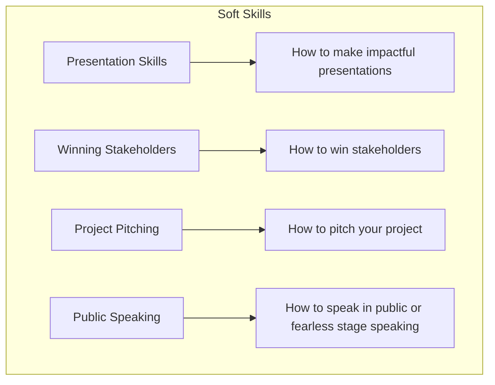

# Goals

 - GenAI
 - Softskills
 - Usecases

## Softskills:

### Presentation Skills

### Winning Stakeholders

### Project Pitching

### Public Speaking

## Usecases:

### product

### price 

### supply chain

### promotions
