# Learning Plan for Large Language Models (LLMs)

## Phase 1: Foundations of Mathematics and Linear Algebra

## Phase 2: Introduction to Machine Learning

```mermaid
graph TD;
    subgraph Phase2["🤖 Phase 2: Machine Learning"]
        C1["Supervised Learning"]
        C1 --> C11["Regression: Linear, Logistic"]
        C1 --> C12["Classification: SVM, Decision Trees"]
        
        C2["Unsupervised Learning"]
        C2 --> C21["Clustering: k-means"]
        C2 --> C22["Dimensionality Reduction: PCA"]
        
        C3["Evaluation"]
        C3 --> C31["Precision, Recall, F1-score"]
        C3 --> C32["ROC-AUC"]
        
        C4["Basics of Neural Networks"]
        C4 --> C41["Perceptron, Backpropagation"]
    end
```

## Phase 3: Natural Language Processing (NLP)

```mermaid
graph TD;
    subgraph Phase3["🗣️ Phase 3: Natural Language Processing (NLP)"]
        D1["Text Preprocessing"]
        D1 --> D11["Tokenization, Lemmatization"]
        D1 --> D12["Stopword Removal, n-grams"]

        D2["Word Embeddings"]
        D2 --> D21["Word2Vec, GloVe"]
        D2 --> D22["Contextual: BERT, ELMo"]

        D3["Sequence Models"]
        D3 --> D31["RNNs, LSTMs, GRUs"]

        D4["Attention & Transformers"]
        D4 --> D41["Self-Attention, Multi-Head Attention"]
        D4 --> D42["Transformer Architecture"]
    end
```

markdown
## Phase 4: Deep Learning and Neural Networks

```mermaid
graph TD;
    subgraph Phase4["🧠 Phase 4: Deep Learning"]
        E1["Deep Neural Networks"]
        E1 --> E11["Activation, Loss Functions"]
        E1 --> E12["Regularization: Dropout, Batch Norm"]

        E2["Convolutional Neural Networks"]
        E2 --> E21["Applications in NLP"]

        E3["Optimization"]
        E3 --> E31["Adam, RMSprop, LR Scheduling"]

        E4["Transfer Learning"]
        E4 --> E41["Fine-Tuning Pre-trained Models"]

        E5["Generative Models"]
        E5 --> E51["VAEs, GANs"]
    end
```

## Phase 5: Large Language Models (LLMs)

```mermaid
graph TD;
    subgraph Phase5["🚀 Phase 5: Large Language Models (LLMs)"]
        F1["Introduction to LLMs"]
        F1 --> F11["GPT, BERT, T5 Overview"]
        F1 --> F12["Pre-training & Fine-tuning"]

        F2["Building LLMs"]
        F2 --> F21["Data Collection"]
        F2 --> F22["Model Architecture"]
        F2 --> F23["Training Pipelines"]
        
        F3["Fine-Tuning"]
        F3 --> F31["Domain-specific Tuning"]
        F3 --> F32["LoRA, Adapters"]

        F4["Mitigation Techniques"]
        F4 --> F41["Prompt Engineering"]
        F4 --> F42["RLHF"]
        F4 --> F43["Fact-Checking & RAG"]

        F5["Deployment & Scaling"]
        F5 --> F51["Model Quantization"]
        F5 --> F52["Serving in Production"]
    end
```

 

To achieve your goal of learning about Large Language Models (LLMs) and acquiring the necessary knowledge and skills to build, fine-tune, and implement guardrails for LLMs, you've identified a solid sequence of topics. Below is a structured training plan with detailed subtopics, learning resources, and a suggested timeline. This plan assumes you are starting from scratch and will progressively build your expertise.

### **Phase 1: Foundations of Mathematics and Linear Algebra**
**Duration:** 2-3 weeks  
**Objective:** Build a strong foundation in vectors, matrices, and mathematical concepts essential for machine learning and deep learning.

#### Topics:
1. **Vectors and Matrices:**
   - Vector operations (addition, subtraction, dot product, cross product)
   - Matrix operations (multiplication, transpose, inverse, determinant)
   - Eigenvalues and eigenvectors
   - Singular Value Decomposition (SVD)
2. **Mathematics for Machine Learning:**
   - Calculus: Derivatives, partial derivatives, gradients, chain rule
   - Probability and Statistics: Probability distributions, Bayes' theorem, expectation, variance
   - Optimization: Gradient descent, convex optimization

#### Resources:
- **Books:**
  - "Linear Algebra Done Right" by Sheldon Axler
  - "Mathematics for Machine Learning" by Marc Peter Deisenroth, A. Aldo Faisal, and Cheng Soon Ong
- **Online Courses:**
  - [Khan Academy: Linear Algebra](https://www.khanacademy.org/math/linear-algebra)
  - [3Blue1Brown: Essence of Linear Algebra (YouTube)](https://www.youtube.com/playlist?list=PLZHQObOWTQDPD3MizzM2xVFitgF8hE_ab)
  - [Coursera: Mathematics for Machine Learning](https://www.coursera.org/specializations/mathematics-machine-learning)

---

### **Phase 2: Introduction to Machine Learning**
**Duration:** 3-4 weeks  
**Objective:** Understand the fundamentals of machine learning, including supervised and unsupervised learning, and how they relate to LLMs.

#### Topics:
1. **Supervised Learning:**
   - Regression (linear, logistic)
   - Classification (decision trees, SVM, k-NN)
2. **Unsupervised Learning:**
   - Clustering (k-means, hierarchical)
   - Dimensionality reduction (PCA, t-SNE)
3. **Evaluation Metrics:**
   - Accuracy, precision, recall, F1-score
   - ROC-AUC, confusion matrix
4. **Basics of Neural Networks:**
   - Perceptron, activation functions, backpropagation

#### Resources:
- **Books:**
  - "Hands-On Machine Learning with Scikit-Learn, Keras, and TensorFlow" by Aurélien Géron
  - "Pattern Recognition and Machine Learning" by Christopher Bishop
- **Online Courses:**
  - [Coursera: Machine Learning by Andrew Ng](https://www.coursera.org/learn/machine-learning)
  - [Fast.ai: Practical Deep Learning for Coders](https://course.fast.ai/)

---

### **Phase 3: Natural Language Processing (NLP)**
**Duration:** 4-5 weeks  
**Objective:** Learn the core concepts of NLP, including text preprocessing, embeddings, and sequence modeling.

#### Topics:
1. **Text Preprocessing:**
   - Tokenization, stemming, lemmatization
   - Stopword removal, n-grams
2. **Word Embeddings:**
   - Word2Vec, GloVe, FastText
   - Contextual embeddings (ELMo, BERT)
3. **Sequence Models:**
   - Recurrent Neural Networks (RNNs)
   - Long Short-Term Memory (LSTM) and Gated Recurrent Units (GRUs)
4. **Attention Mechanism:**
   - Basics of attention and its role in NLP
5. **Transformers:**
   - Self-attention, multi-head attention
   - Transformer architecture

#### Resources:
- **Books:**
  - "Speech and Language Processing" by Daniel Jurafsky and James H. Martin
  - "Deep Learning for NLP" by Yoav Goldberg
- **Online Courses:**
  - [Coursera: Natural Language Processing Specialization](https://www.coursera.org/specializations/natural-language-processing)
  - [Hugging Face Course](https://huggingface.co/course/chapter1)

---

### **Phase 4: Deep Learning and Neural Networks**
**Duration:** 4-5 weeks  
**Objective:** Dive deeper into deep learning concepts, including advanced architectures and optimization techniques.

#### Topics:
1. **Deep Neural Networks (DNNs):**
   - Architecture, activation functions, loss functions
   - Regularization techniques (dropout, batch normalization)
2. **Convolutional Neural Networks (CNNs):**
   - Applications in NLP (e.g., text classification)
3. **Optimization:**
   - Adam, RMSprop, learning rate scheduling
4. **Transfer Learning:**
   - Fine-tuning pre-trained models
5. **Generative Models:**
   - Variational Autoencoders (VAEs), Generative Adversarial Networks (GANs)

#### Resources:
- **Books:**
  - "Deep Learning" by Ian Goodfellow, Yoshua Bengio, and Aaron Courville
- **Online Courses:**
  - [Deep Learning Specialization by Andrew Ng](https://www.coursera.org/specializations/deep-learning)
  - [PyTorch Tutorials](https://pytorch.org/tutorials/)

---

### **Phase 5: Large Language Models (LLMs)**
**Duration:** 6-8 weeks  
**Objective:** Gain hands-on experience with LLMs, including building, fine-tuning, and implementing guardrails.

#### Topics:
1. **Introduction to LLMs:**
   - Overview of GPT, BERT, T5, and other architectures
   - Pre-training and fine-tuning
2. **Building LLMs from Scratch:**
   - Data collection and preprocessing
   - Model architecture design
   - Training pipelines
3. **Fine-Tuning LLMs:**
   - Domain-specific fine-tuning
   - Parameter-efficient fine-tuning (LoRA, Adapters)
4. **Guardrails and Hallucination Mitigation:**
   - Prompt engineering
   - Reinforcement Learning with Human Feedback (RLHF)
   - Fact-checking and retrieval-augmented generation (RAG)
5. **Deployment and Scaling:**
   - Model quantization, distillation
   - Serving LLMs in production (e.g., using Hugging Face, TensorFlow Serving)

#### Resources:
- **Books:**
  - "Transformers for Natural Language Processing" by Denis Rothman
- **Online Courses:**
  - [Hugging Face Course](https://huggingface.co/course/chapter1)
  - [Full Stack LLM Bootcamp](https://fullstackdeeplearning.com/llm-bootcamp)
- **Tools and Frameworks:**
  - Hugging Face Transformers
  - PyTorch, TensorFlow
  - OpenAI API, LangChain

---

### **Phase 6: Advanced Topics and Projects**
**Duration:** 4-6 weeks  
**Objective:** Apply your knowledge to real-world projects and explore advanced topics.

#### Topics:
1. **Advanced LLM Architectures:**
   - Sparse transformers, mixture of experts (MoE)
2. **Multimodal Models:**
   - Combining text, images, and audio (e.g., CLIP, Flamingo)
3. **Ethics and Bias in LLMs:**
   - Fairness, interpretability, and accountability
4. **Capstone Project:**
   - Build an end-to-end LLM application (e.g., chatbot, summarization tool)

#### Resources:
- **Research Papers:**
  - [Papers with Code](https://paperswithcode.com/)
  - [arXiv](https://arxiv.org/)
- **Communities:**
  - Hugging Face forums
  - Reddit: r/MachineLearning, r/LanguageTechnology

---

### **Suggested Timeline**
- **Phase 1:** 2-3 weeks
- **Phase 2:** 3-4 weeks
- **Phase 3:** 4-5 weeks
- **Phase 4:** 4-5 weeks
- **Phase 5:** 6-8 weeks
- **Phase 6:** 4-6 weeks

Total: **23-31 weeks** (~6-8 months)

---

### **Tips for Success**
1. **Hands-On Practice:** Implement concepts using Python libraries like NumPy, PyTorch, and TensorFlow.
2. **Stay Updated:** Follow research papers and blogs (e.g., OpenAI, DeepMind, Hugging Face).
3. **Join Communities:** Engage with ML/NLP communities on Discord, Reddit, or Twitter.
4. **Build Projects:** Apply your knowledge to real-world problems to solidify your understanding.

By following this plan, you'll be well-equipped to build, fine-tune, and deploy LLMs while mitigating risks like hallucination. Good luck!
